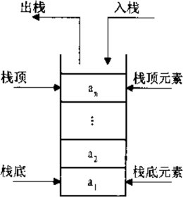

# Python 

## 1. 链表
链表(linked list)是一种物理存储单元上非连续、非顺序的存储结构，数据元素的逻辑顺序是通过链表中的指针链接次序实现的。链表由一系列结点（链表中每一个元素称为结点）组成，结点可以在运行时动态生成。每个结点包括两个部分：一个是存储数据元素的数据域，另一个是存储下一个结点地址的指针域。

链表定位元素只能按照指针链，逐个查找，没有顺序表的索引结构。链表中CRUD操作的时间复杂度分别为，头插法`O(1)`,尾插法和定位插入`O(n)`,删除`O(n)`，修改和查询均为`O(n)`。

### 1.1 单向链表

单向链(Single Linked List)表也叫单链表，是链表中最简单的一种形式，单链表中的数据是以结点来表示的，每个结点的构成：元素 + 指针，元素就是存储数据的存储单元，指针就是连接每个结点的地址数据。

单链表中每个结点的存储地址是存放在其前趋结点next域中，而开始结点无前趋，故应设头指针`head`指向开始结点。链表由头指针唯一确定，单链表可以用头指针的名字来命名。终端结点无后继，故终端结点的指针域为空(None)。

### 1.2 单向循环链表
单向循环链表是单链表的另一种形式，其结构特点链表中最后一个结点的指针域不再是结束标记，而是指向整个链表的第一个结点，从而使链表形成一个环。

### 1.3 双向链表
双向链表也叫双链表，是链表的一种，它的每个数据结点中都有两个指针，分别指向直接后继和直接前驱。所以，从双向链表中的任意一个结点开始，都可以很方便地访问它的前驱结点和后继结点。一般我们都构造双向循环链表。

### 1.4 顺序表与链表
顺序表与链表同属线性表。

顺序表利用连续内存地址关联元素，可以迅速定位元素位置，查询和更新操作比较高效，但大量频繁的扩充元素则需要重新申请大块连续内存迁移所有的元素，执行效率偏低，删除操作则需要将删除元素后的所有元素前移。

链表通过节点指针串联元素，可以更好地利用非连续内存，但定位节点只能顺着指针连逐次查找，因此查询很更新操作比较低效。但新增节点则只需要申请新的内存挂在到现有链表中，删除元素则只需要修改前驱和后继节点的指针指向即可，因此新增和删除操作更加灵活高效。

在数据元素较少且规模相对固定，更多执行查询和更新操作的场景中，推荐使用稳定性更好的顺序表；相反的，数据规模未知且变动频繁，更多执行插入和删除操作的场景中推荐使用链表。

### 1.5 Python 链表

链表结构在不同的开发平台都有各自语言的版本实现，如链表在C#当中实现为`LinkedList<T>`，而Python并没有内建链表实现，需要我们自定义实现。[linkedlist.py](linklist.py)即是一种链表的自定义实现。

> 关于链表更多内容，请参阅 https://colin-chang.site/python/datastructure/linkedlist.html

## 2. 栈 / 队列
### 2.1 栈

栈（stack）又名堆栈，它是一种运算受限的线性表。限定仅在表尾进行插入和删除操作的线性表。这一端被称为栈顶，相对地，把另一端称为栈底。向一个栈插入新元素又称作进栈、入栈或压栈，它是把新元素放到栈顶元素的上面，使之成为新的栈顶元素；从一个栈删除元素又称作出栈或退栈，它是把栈顶元素删除掉，使其相邻的元素成为新的栈顶元素。

由于栈数据结构只允许在一端进行操作，因而按照后进先出（LIFO, Last In First Out）的原理运作。

栈在Python中也没有默认提供，需要我们自定义实现。[linearcollection.py](linearcollection.py)演示了中使用顺序表实现栈。

### 2.2 队列
队列(queue)是一种特殊的线性表，特殊之处在于它只允许在表的前端（front）进行删除操作，而在表的后端（rear）进行插入操作，和栈一样，队列是一种操作受限制的线性表。进行插入操作的端称为队尾，进行删除操作的端称为队头。

队列的数据元素又称为队列元素。在队列中插入一个队列元素称为入队，从队列中删除一个队列元素称为出队。因为队列只允许在一端插入，在另一端删除，所以只有最早进入队列的元素才能最先从队列中删除，故队列又称为先进先出（FIFO—first in first out）线性表。

队列在Python中也没有默认提供，需要我们自定义实现。[linearcollection.py](linearcollection.py)演示了中使用顺序表实现队列。

### 2.3 双端队列

双端队列（deque，全名double-ended queue），是一种具有队列和栈的性质的数据结构。双端队列中的元素可以从两端弹出，其限定插入和删除操作在表的两端进行。双端队列可以在队列任意一端入队和出队。Redis的List类型就是双端队列。

双端队列在Python中也没有默认提供，需要我们自定义实现。[linearcollection.py](linearcollection.py)演示了中使用顺序表实现双端队列。

> 关于栈和队列的更多内容，请参阅 https://colin-chang.site/python/datastructure/stackqueue.html
